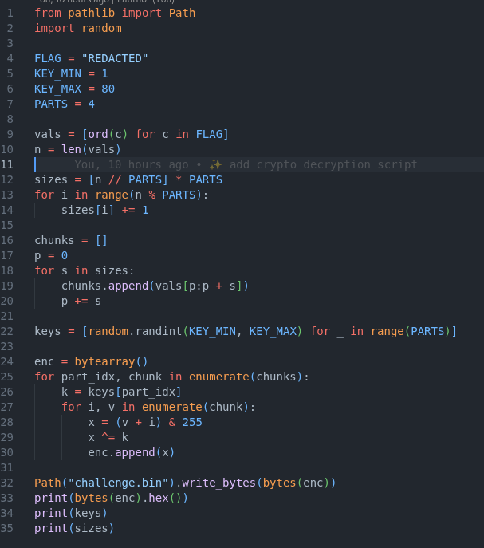

# chunks

**About:**

- Category: crypto
- Difficulty: medium

**Subject:**

Find the flag [https://cdn.cattheflag.org/cybercup/Team/Chunks/challenge.bin](https://cdn.xn--cattheag-0f58b.org/cybercup/Team/Chunks/challenge.bin) https://
[cdn.cattheflag.org/cybercup/Team/Chunks/enc.py](http://cdn.xn--cattheag-0f58b.org/cybercup/Team/Chunks/enc.py) Format flag: CCOI26{...}

---

In this challenge, we are given **challenge.bin** which contain the encrypted flag and **enc.py** which is our program to encrypt it.

First let’ s start by check what **enc.py do.**

**Encryption:**

It splits the flag into 4 parts, adds the byte’s position inside its chunk, XORs each part with a different random key, saves the result, and prints the encrypted data, keys, and chunk sizes.

**Decryption:**

For the decryption, we just need to reverse each line of encryption used.

 

Then we have this result:

where our flag is: CCOI26{ChUnK5_0f_K3y5_4nd_0ff53t5}