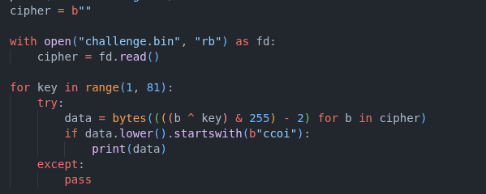

# easy_peasy

**About:**

- Category: crypto
- Difficulty: easy

**Subject:**

Find the flag [https://cdn.cattheflag.org/cybercup/Team/Easy_Peasy/enc.py](https://cdn.xn--cattheag-0f58b.org/cybercup/Team/Easy_Peasy/enc.py) https://
[cdn.cattheflag.org/cybercup/Team/Easy_Peasy/challenge.bin](http://cdn.xn--cattheag-0f58b.org/cybercup/Team/Easy_Peasy/challenge.bin) Format flag: CCOI26{...}

---

In this challenge, we are given **challenge.bin** which contain the encrypted flag and **enc.py** which is our program to encrypt it.

First let’ s start by check what **enc.py do.**

```jsx
from pathlib import Path
import random
FLAG = b"REDACTED"
KEY_MIN = 1
KEY_MAX = 80
KEY = random.randint(KEY_MIN, KEY_MAX)
data = bytes((((b + 2) & 255) ^ KEY) for b in FLAG)
Path("challenge.bin").write_bytes(data)
print(data.hex())
print(KEY)
```

**Encryption:**

It takes the flag, adds 2 to each byte, XORs it with a random key (1–80), saves the result to a file, and prints both the encrypted data and the key.

**Decryption:**

For the decryption, we have two methods:

1. **Reversing**

We can just reverse each line of the encryption



1. **Brute forcing**

Like the range of the random number is small we can brute force it. Like see byte by byte what in ASCII give this exact byte.

 


Then we have this result:


where our flag is: CCOI26{_eAsY_PeAsY_1s_3v3n_b3tt3r_w1th_4_k3y}