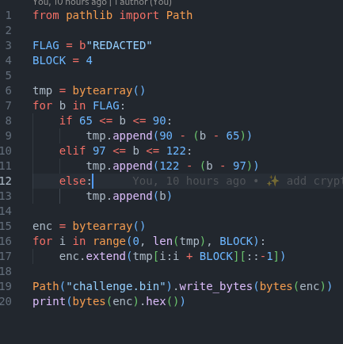

# easy_peasy_2

**About:**

- Category: crypto
- Difficulty: easy

**Subject:**

Decrypt file and find the flag [https://cdn.cattheflag.org/cybercup/Team/Easy_Peasy_2/](https://cdn.xn--cattheag-0f58b.org/cybercup/Team/Easy_Peasy_2/)
challenge.bin [https://cdn.cattheflag.org/cybercup/Team/Easy_Peasy_2/enc.py](https://cdn.xn--cattheag-0f58b.org/cybercup/Team/Easy_Peasy_2/enc.py) Format
flag: CCOI26{...}

---

In this challenge, we are given **challenge.bin** which contain the encrypted flag and **enc.py** which is our program to encrypt it.

First let’ s start by check what **enc.py do.**

**Encryption:**

It applies an **Atbash cipher** (alphabet mirror) to the flag, then reverses every 4-byte block, saves the result to a file, and prints it in hex.

**Decryption:**

For the decryption, we just need to reverse each line of encryption used.

 

Then we have this result:

where our flag is: CCOI26{*3asy_p3asy_2_4ll_3asy_p3asy*}