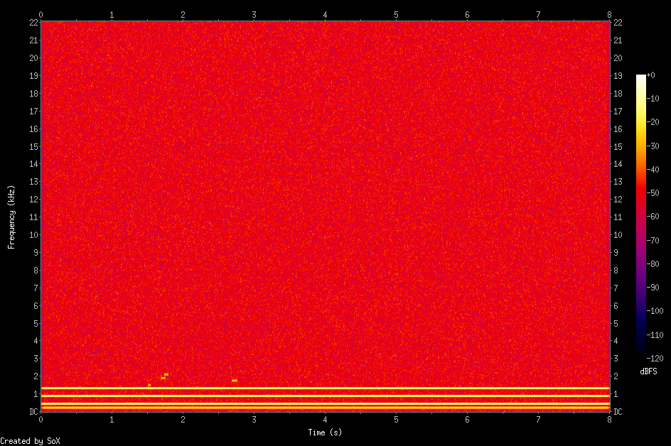
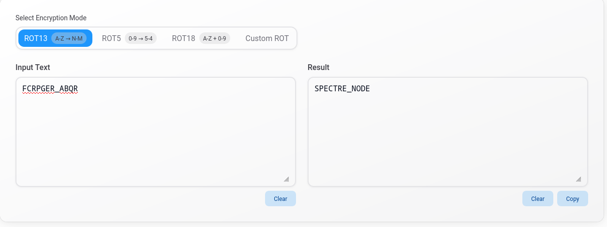
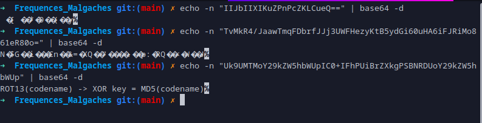

# Fréquences Malgaches

- Type: Forensics
- Difficulté: Moyen
- Auteur: 0sh4w077
- Team: 71M_R0CK373

## Déscription:

L'agent a transmis un second fichier : un enregistrement audio capté sur une fréquence radio illicite dans la région malgache. Les analystes ont passé des heures sur le spectrogramme. Rien. Pourtant, le fichier contient quelque chose. Regardez là où les outils ne regardent pas. *Prérequis narratif : avoir résolu "Fantôme de la Vanille"
https://drive.google.com/file/d/1bf-SD6HShyRUmzY21Qm4fmQv5vwlwp6i/view?usp=sharing 

## Phase  d'investigation:
### *__file__*

```bash
$ file frequences_malgaches.wav

```

Resultat:
---
```text
frequences_malgaches.wav: RIFF (little-endian) data, WAVE audio, Microsoft PCM, 16 bit, mono 44100 Hz
```

C'est un fichier audio WAV. De ce cÔté, tout est normal.
Mais vu que c'est de l'audio, regargons du côté des spectrogram

```bash
$ sox frequences_malgaches.wav -n spectrogram -o out.png
```
Résultat:


Il n'y a rien d'interessant.

On continue.

### strings

```bash
$ strings fantome_vanille.png

```
Résultat:
---

```text
RIFF
WAVEfmt 
data@
#r!9!
-a(S)y+b%e,3,
'E/C+B443
0X844d0'2
a	~	p
( P)^*
+B4&*
:<C!@p8
6<3!0
.:$A
7O; C	A+H
Fx<d8
(7'j"
z2	-
Mi@3Ao6
5p77-a+A$
?`/)0W0C.!#

.............

OCOI
FCRPGER_ABQR
IIJbIIXIKuZPnPcZKLCueQ==
TvMkR4/JaawTmqFDbrfJJj3UWFHezyKtB5ydGi60uHA6iFJRiMo861eR80o=
Uk9UMTMoY29kZW5hbWUpIC0+IFhPUiBrZXkgPSBNRDUoY29kZW5hbWUp


```

Hummm... intéressant!

Il me semble qu'on a decouvert quelque chose d'utile!
```text
OCOI
FCRPGER_ABQR
IIJbIIXIKuZPnPcZKLCueQ==
TvMkR4/JaawTmqFDbrfJJj3UWFHezyKtB5ydGi60uHA6iFJRiMo861eR80o=
Uk9UMTMoY29kZW5hbWUpIC0+IFhPUiBrZXkgPSBNRDUoY29kZW5hbWUp
```

Ça, c'est du ROT13 -> `FCRPGER_ABQR
Decryptons le!



Résultat:
---
```text
SPECTRE_NODE

```
Les autres, c'est du base64


Une indice pour le decryptage! `ROT13(codename) -> XOR key = MD5(codename)` 

Donc, ce payload a été crypté selon cette methode. Il faut donc le decrypt.

> Cryptage md5
```bash
$ echo -n "SPECTRE_NODE" | md5sum

```

Résultat:
---
```text
0db06b0ebdff12df63a9c2371c849648  -

```

Créons un script python!
```python3
import base64
import hashlib

def xor_data(data, key):
    return bytes([data[i] ^ key[i % len(key)] for i in range(len(data))])

cipher_b64 = "TvMkR4/JaawTmqFDbrfJJj3UWFHezyKtB5ydGi60uHA6iFJRiMo861eR80o="
cipher_bytes = base64.b64decode(cipher_b64)

key_raw = bytes.fromhex("0db06b0ebdff12df63a9c2371c849648")
result_raw = xor_data(cipher_bytes, key_raw)

print(result_raw.decode(errors='ignore'))
```

> Lancer le script:
---

```bash
$ python3 frequence.py

```
Résultat:
---
`CCOI26{sp3ctr3_n0d3_c00rd5_-20.8789_55.4481}`

Voilà! C'est ce qui conclu ce challenge! 
