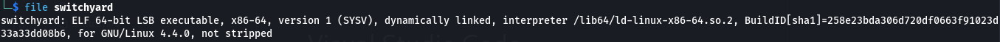

# SwitchYard

**About:**

- Category: Pwn
- Difficulty: Medium

**Subject:**

Let's go to pwn chall [https://cdn.cattheflag.org/cybercup/Team/SwitchYard/switchyard](https://cdn.xn--cattheag-0f58b.org/cybercup/Team/SwitchYard/switchyard)
tcp://95.216.124.220:30882 Flag format: CCOI26{....}

---

**Enum:**

So first, let’s see what we have here.




**Binary details:**

- ELF 64 bits
- dynamically linked
- not stripped (symbols present)
- No stack canary protection
- No PIE enabled (fixed address)
- Nx enabled

After that let’s check what does this binary and what vulnerability we may encounter.


So from what we see, the binary take 2 inputs and print some response after.

But internally, we have:

```c

void route_local(void)

{
  puts("\n[.] Routed to local maintenance loop.");
  fflush(stdout);
  return;
}

void route_quarantine(void)

{
  puts("\n[.] Routed to quarantine buffer.");
  fflush(stdout);
  return;
}

void route_denied(void)

{
  puts("\n[-] Route denied by control policy.");
  fflush(stdout);
  return;
}

void win(void)

{
  puts("\n[+] Supervisor override accepted.");
  puts("[+] Opening privileged dispatch channel...");
  fflush(stdout);
  system("cat flag.txt");
  return;
}

void banner(void)

{
  puts("========================================");
  puts("            S W I T C H Y A R D         ");
  puts("========================================");
  puts("  Transit Control Console v2.4");
  puts("  Yard mode: assisted manual dispatch");
  puts("----------------------------------------");
  fflush(stdout);
  return;
}

undefined8 main(void)
{
  int iVar1;
  char *pcVar2;
  char local_98 [32];
  undefined1 auStack_78 [64];
  code *local_38;
  code *local_30;
  uint local_28;
  ssize_t local_18;
  int local_c;
  
  memset(local_98,0,0x78);
  local_38 = route_denied;
  local_30 = route_quarantine;
  local_28 = 0x41424344;
  banner();
  printf("Route label: ");
  fflush(stdout);
  local_18 = read(0,local_98,0x1f);
  if (local_18 < 1) {
    puts("\n[-] No route label received.");
    fflush(stdout);
  }
  else {
    for (local_c = 0; local_c < (int)local_18; local_c = local_c + 1) {
      if (local_98[local_c] == '\n') {
        local_98[local_c] = '\0';
        break;
      }
    }
    iVar1 = strncmp(local_98,"local",5);
    if (iVar1 == 0) {
      local_38 = route_local;
    }
    else {
      iVar1 = strncmp(local_98,"yard",4);
      if (iVar1 == 0) {
        local_38 = route_quarantine;
      }
      else {
        local_38 = route_denied;
      }
    }
    if (local_98[0] == '\0') {
      pcVar2 = "unnamed";
    }
    else {
      pcVar2 = local_98;
    }
    printf("Loaded route \'%s\' (id=0x%08x)\n",pcVar2,(ulong)local_28);
    printf("Maintenance packet: ");
    fflush(stdout);
    read(0,auStack_78,0x100);
    puts("\nDispatching primary route...");
    fflush(stdout);
    (*local_38)();
    if (local_28 == 0x1337c0de) {
      puts("[.] Route marker acknowledged by yard controller.");
      fflush(stdout);
      puts("[.] Running backup route...");
      fflush(stdout);
      (*local_30)();
    }
  }
  return 0;
}
```

we have some functions (main, win, …) .

In the main, we have all logic of our program. In this, we have 2 read but for the first one we are limited by the character we put in it but in the second read we have a variable of 78 bytes but where we can put up to 256 (0x100) bytes so basically our vulnerability: **stack buffer overflow** that will allow use to **manipulate the stack.** 


One interesting function here also is the win function. There is no normal way to get into this via the main function but like we have a stack bof, we can trick our way to get into it. It ‘s basically some **ret2win challenge.** But there is a trick in this.


After the read, there is  a direct call to a function via its address that is contained in some local variable.

---

**Goal:**

So from our enumeration, our goal in this challenge is to **overwrite the local variable local_38 here (used to directly call a function) using the stack buffer overflow vulnerability.** 

---

**Exploit:**

So first, we need to see where in the stack the local variable and the buffer are located and calculated offset needed to get into these address.

1. Locate the local variable address 


As we can see, our buffer start at rbp - 0x90 + 0x20 and local_38 is at rbp - 0x30

1. Calculate the offset

So for the offset we have offset = 0x90 -0x20 - 0x30 = 64 bytes.

In our exploit, we ‘ll put 64  * ‘A’ + little endian address of win function

So using our ***exploit.py***, locally we can create a test flag and we get:


But for the remote version we need to use ***remote*** instead of ***process*** inside of our script.

and for the flag we have: CCOI26{*sWiTcH_YaRD_PwN3d_g00d_J0b*}
