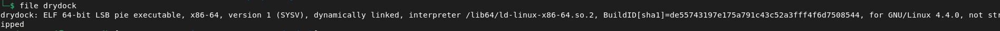

# DryDock

**About:**

- Category: **Pwn**
- Difficult: **Hard**

**Subject:**

We continue with pwn chall [https://cdn.cattheflag.org/cybercup/Team/DryDock/drydock](https://cdn.xn--cattheag-0f58b.org/cybercup/Team/DryDock/drydock)
tcp://95.216.124.220:30224 Format flag: CCOI26{...}

---

**Enum:**

So first, let’s see what we have here.




**Binary details:**

- ELF 64 bits
- dynamically linked
- not stripped (symbols present)
- No stack canary protection
- PIE enabled (No fixed address)
- Nx enabled

After that let’s check what does this binary and what vulnerability we may encounter.


So from what we see, the binary allows to do some action based on the choice we choose.

But the binary itself prints two pointers before the menu every single time it starts. The banner names them "bay marker" and "supervisor marker". This is the intentional PIE leak we will use to defeat ASLR.


But internally, we have:

```c

void flushall(void)

{
  fflush(stdout);
  fflush(stderr);
  return;
}

void read_line(undefined1 *param_1,long param_2)

{
  ulong uVar1;
  ulong local_10;
  
  if ((param_1 != (undefined1 *)0x0) && (param_2 != 0)) {
    uVar1 = read(0,param_1,param_2 - 1);
    if ((long)uVar1 < 1) {
      *param_1 = 0;
    }
    else {
      param_1[uVar1] = 0;
      for (local_10 = 0; local_10 < uVar1; local_10 = local_10 + 1) {
        if (param_1[local_10] == '\n') {
          param_1[local_10] = 0;
          return;
        }
      }
    }
  }
  return;
}

void read_int(void)

{
  char local_28 [32];
  
  read_line(local_28,0x20);
  atoi(local_28);
  return;
}

void route_idle(void)

{
  puts("[.] Job completed in standard dock mode.");
  flushall();
  return;
}

void route_fail(void)

{
  puts("[-] Job dispatch rejected by supervisor.");
  flushall();
  return;
}

void win(void)

{
  puts("[+] Supervisor override accepted.");
  puts("[+] Opening drydock privileged channel...");
  flushall();
  system("cat flag.txt");
  return;
}

void banner(void)

{
  puts("========================================");
  puts("              D R Y D O C K             ");
  puts("========================================");
  puts("  Service Bay Controller v4.8 (PIE)");
  puts("  Mode: mixed manual / assisted dispatch");
  puts("----------------------------------------");
  printf("[diag] bay marker=%p supervisor marker=%p\n",main,win);
  flushall();
  return;
}

void menu(void)

{
  putchar(10);
  puts("1) Create job");
  puts("2) Edit job name");
  puts("3) Delete job");
  puts("4) Create note");
  puts("5) Edit note");
  puts("6) Run job");
  puts("7) List status");
  puts("8) Exit");
  printf("> ");
  flushall();
  return;
}

void create_job(void)

{
  char *pcVar1;
  int iVar2;
  
  if (g_job == (char *)0x0) {
    g_job = malloc(0x30);
    if (g_job == (char *)0x0) {
      puts("[-] Allocation failed.");
      flushall();
                    // WARNING: Subroutine does not return
      _exit(1);
    }
    memset(g_job,0,0x30);
    *(code **)(g_job + 0x20) = route_fail;
    builtin_strncpy(g_job + 0x28,"KCOD",4);
    pcVar1 = g_job;
    pcVar1[0x2c] = '\x01';
    pcVar1[0x2d] = '\0';
    pcVar1[0x2e] = '\0';
    pcVar1[0x2f] = '\0';
    printf("Job label: ");
    flushall();
    read_line(g_job,0x20);
    iVar2 = strncmp(g_job,"standard",8);
    if (iVar2 == 0) {
      *(code **)(g_job + 0x20) = route_idle;
    }
    puts("[+] Job created.");
    flushall();
  }
  else {
    puts("[!] A job slot is already active.");
    flushall();
  }
  return;
}

void edit_job_name(void)

{
  if (g_job == 0) {
    puts("[-] No active job.");
    flushall();
  }
  else {
    printf("New job label: ");
    flushall();
    read_line(g_job,0x20);
    puts("[+] Job label updated.");
    flushall();
  }
  return;
}

void delete_job(void)

{
  if (g_job == (void *)0x0) {
    puts("[-] No active job.");
    flushall();
  }
  else {
    free(g_job);
    puts("[+] Job released from bay.");
    flushall();
  }
  return;
}

void create_note(void)

{
  void *pvVar1;
  uint local_10;
  uint local_c;
  
  local_c = 0xffffffff;
  local_10 = 0;
  do {
    if (7 < (int)local_10) {
LAB_0010169a:
      if ((int)local_c < 0) {
        puts("[-] Note storage full.");
        flushall();
      }
      else {
        pvVar1 = malloc(0x30);
        *(void **)(g_notes + (long)(int)local_c * 8) = pvVar1;
        if (*(long *)(g_notes + (long)(int)local_c * 8) == 0) {
          puts("[-] Allocation failed.");
          flushall();
                    // WARNING: Subroutine does not return
          _exit(1);
        }
        memset(*(void **)(g_notes + (long)(int)local_c * 8),0,0x30);
        printf("Note[%d] payload: ",(ulong)local_c);
        flushall();
        read(0,*(void **)(g_notes + (long)(int)local_c * 8),0x60);
        printf("[+] Note[%d] stored.\n",(ulong)local_c);
        flushall();
      }
      return;
    }
    if (*(long *)(g_notes + (long)(int)local_10 * 8) == 0) {
      local_c = local_10;
      goto LAB_0010169a;
    }
    local_10 = local_10 + 1;
  } while( true );
}

void edit_note(void)

{
  uint uVar1;
  
  printf("Index: ");
  flushall();
  uVar1 = read_int();
  if ((((int)uVar1 < 0) || (7 < (int)uVar1)) || (*(long *)(g_notes + (long)(int)uVar1 * 8) == 0)) {
    puts("[-] Invalid note index.");
    flushall();
  }
  else {
    printf("Note[%d] new payload: ",(ulong)uVar1);
    flushall();
    read(0,*(void **)(g_notes + (long)(int)uVar1 * 8),0x60);
    printf("[+] Note[%d] updated.\n",(ulong)uVar1);
    flushall();
  }
  return;
}

void run_job(void)

{
  if (g_job == 0) {
    puts("[-] No active job.");
    flushall();
  }
  else {
    printf("[.] Dispatching job id=0x%08x state=%u\n",(ulong)*(uint *)(g_job + 0x28),
           (ulong)*(uint *)(g_job + 0x2c));
    flushall();
    if (*(long *)(g_job + 0x20) == 0) {
      puts("[-] Missing completion handler.");
      flushall();
    }
    else {
      (**(code **)(g_job + 0x20))();
    }
  }
  return;
}

void list_status(void)

{
  char *pcVar1;
  uint local_c;
  
  puts("--- status ---");
  if (g_job == (char *)0x0) {
    puts("job: none");
  }
  else {
    printf("job: present @ %p\n",g_job);
    pcVar1 = g_job;
    if (*g_job == '\0') {
      pcVar1 = "(empty)";
    }
    printf("name: %s\n",pcVar1);
    printf("id=0x%08x state=%u handler=%p\n",(ulong)*(uint *)(g_job + 0x28),
           (ulong)*(uint *)(g_job + 0x2c),*(undefined8 *)(g_job + 0x20));
  }
  for (local_c = 0; (int)local_c < 8; local_c = local_c + 1) {
    if (*(long *)(g_notes + (long)(int)local_c * 8) != 0) {
      printf("note[%d]: present @ %p\n",(ulong)local_c,
             *(undefined8 *)(g_notes + (long)(int)local_c * 8));
    }
  }
  flushall();
  return;
}

undefined8 main(void)

{
  int iVar1;
  
  setvbuf(stdout,(char *)0x0,2,0);
  setvbuf(stderr,(char *)0x0,2,0);
  memset(g_notes,0,0x40);
  banner();
LAB_00101a94:
  menu();
  iVar1 = read_int();
  if (iVar1 == 8) {
    puts("bye");
    flushall();
    return 0;
  }
  if (iVar1 < 9) {
    if (iVar1 == 7) {
      list_status();
      goto LAB_00101a94;
    }
    if (iVar1 < 8) {
      if (iVar1 == 6) {
        run_job();
        goto LAB_00101a94;
      }
      if (iVar1 < 7) {
        if (iVar1 == 5) {
          edit_note();
          goto LAB_00101a94;
        }
        if (iVar1 < 6) {
          if (iVar1 == 4) {
            create_note();
            goto LAB_00101a94;
          }
          if (iVar1 < 5) {
            if (iVar1 == 3) {
              delete_job();
              goto LAB_00101a94;
            }
            if (iVar1 < 4) {
              if (iVar1 == 1) {
                create_job();
              }
              else {
                if (iVar1 != 2) goto LAB_00101b4f;
                edit_job_name();
              }
              goto LAB_00101a94;
            }
          }
        }
      }
    }
  }
LAB_00101b4f:
  puts("?");
  flushall();
  goto LAB_00101a94;
}
```

There are some function but the name win stands out immediately. Like this function allows use to get the flag.


With this function, the question is how can we trigger a call to this function.

Let’s now see whose address are printed in the banner function.


we have the first pointer (the bay marker) = address of the main function and the second (the supervisor marker)= address of the win function. 

Now we have our win function and its address. Let’s dive into what vulnerability we can see in this.

We have caught 2 vulnerability in this binary.

1. a Use After Free vulnerability

In the delete_job, g_job is freed but is not set to NULL. So g_job is acting like a dangling pointer.


And like it is not set to NULL it may cause some double free like the condition will be not triggered.

 


1. a Heap Buffer Overflow

Inside create_note() there is a size mismatch between allocation and read. Malloc allocates 0x30 bytes. Then read accepts 0x60 bytes. 


But aside for these vulnerability there is also an interesting tricks in the run_job function like in this there is a call of function contain in the address in g_job + 0x20.


It is even better in assembly like it’s not a call to a defined or libc function but directly a pointer contained in a register


---

**Goal:**

So from our enumeration, our goal in this challenge is to redirect the call g_job + 0x20 stored inside the run_job struct to point to win(). We do this by combining both vulnerabilities: the UAF creates a heap alias, and the overflow overwrites the target field.

---

**Exploit:**

Step 1 — Connect & Parse the PIE Leak
The binary leaks two addresses in the banner. We read and parse them before sending any input.


Step 2 — Create Job
Send menu choice 1, then provide a job name that is NOT "standard" (using "standard" would change the pointer at g_job + 0x20 to route_idle, not route_fail — either works for our purposes but we use "hacker" to be explicit).


Step 3 — Delete Job (Introduce UAF)
Send menu choice 3. The job is freed but g_job is never set to NULL.


Step 4 — Create Note[0] (Trigger Tcache Reuse / Heap Alias)
Send menu choice 4. glibc's tcache returns chunk_A for the malloc(0x30) inside create_note. Both
g_job and g_notes[0] now point to the same memory. We wait for the prompt before sending the
payload — this is a critical timing detail.

Step 5 — Send Overflow Payload (Overwrite the g_job + 0x20)
Now send the 96-byte payload that overwrites the g_job + 0x20 with the address of win()


Step 6 — Run Job → Trigger win() → Flag
Send menu choice 6. run_job() reads g_job + 0x20 (which is now win()) and calls it. win() calls
system("cat flag.txt"), printing the flag.


But for the remote version we need to use ***remote*** instead of ***process*** inside of our script **exploit.py**.