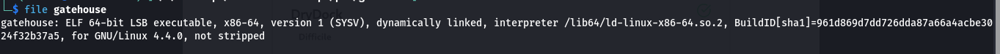

# gatehouse

**About:**

- Category: Pwn
- Difficult: Medium

**Subject:**

Let's go to Pwn Chall [https://cdn.cattheflag.org/cybercup/Team/Gatehouse/gatehouse](https://cdn.xn--cattheag-0f58b.org/cybercup/Team/Gatehouse/gatehouse)
tcp://95.216.124.220:30593 Flag Format: CCOI26{...}

---

**Enum:**

So first, let’s see what we have here.




**Binary details:**

- ELF 64 bit
- dynamically linked
- not stripped (symbols present)
- No stack canary protection
- No PIE enabled (fixed address when the binary is launched for local and remote)
- Nx enabled (no shellcode)

After that let’s check what does this binary and what vulnerability we may encounter.


So from what we see, the binary just take some credential as input and print then some response.

But internally, we have:

```c
undefined8 main(void)

{
  undefined1 buffer [72];
  uint local_10;
  int local_c;
  
  local_c = 0;
  local_10 = 0;
  puts("========================================");
  puts("            G A T E H O U S E           ");
  puts("========================================");
  puts("  Access Terminal v1.3");
  puts("  Clearance required for privileged mode");
  puts("----------------------------------------");
  printf("Enter credential string: ");
  fflush(stdout);
  read(0,buffer,0x100);
  if ((local_c == 0x1337) && (local_10 == 0xc0ffee00)) {
    puts("\n[+] Privileged session established.");
    fflush(stdout);
    system("cat flag.txt");
  }
  else if (local_c == 0x1337) {
    puts("\n[!] Privileged bit accepted, secondary token invalid.");
    printf("[!] token=0x%08x\n",(ulong)local_10);
    fflush(stdout);
  }
  else {
    puts("\n[-] Access denied.");
    fflush(stdout);
  }
  return 0;
}
```

we have a main function where inside:

- there is some buffer of 72 bytes where  we ‘ll put 0x100 bytes (256 bytes) of data. So eventually, it will cause a **stack buffer overflow.**
- there are two local variable (local_10 and local_c) and if the variable local_c == 0x1337 and local_10 == 0xc0ffee00, it will give use the flag. But there is no direct way to set these variable.

---

**Goal:**

So from our enumeration, our goal in this challenge is to **overwrite the two local variable using the stack buffer overflow vulnerability.** 

---

**Exploit:**

So first, we need to see at where are these two addresses and the buffer are located and calculated offset needed to get into these address.

1. Locate the local variable address


As we can see, our buffer start at rbp - 0x50 and local_c is at rbp - 0x4, local_10 at rbp - 0x8

1. Calculate the offset

So for the offset we have offset = 0x50 - 0x8 = 72 bytes.

In our exploit, we ‘ll put 72  * ‘A’ + 0xc0ffee00 into 4 bytes little endian + 0x1337 into 4 bytes little endian

So using our ***exploit.py***, locally we can create a test flag and we get:


But for the remote version we need to use ***remote*** instead of ***process*** inside of our script.

and for the flag we have: CCOI26{*G00d_J0B_Y0U_bROk3_G4tE_h0USE*}