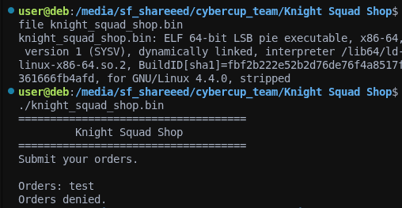
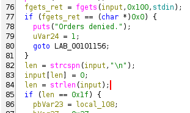
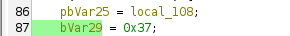
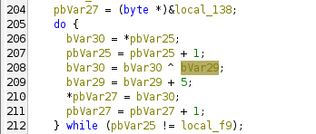
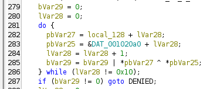
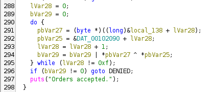
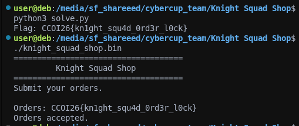

# Knight Squad Shop — Writeup

**Category:** Reverse Engineering  
**Flag format:** `CCOI26{}`  
**Tools used:** Ghidra, Python 3
file given : knight_squad_shop.bin

challenge : Get a valid order


---

## 1. Initial Recon



Running the binary shows a simple prompt.

It either prints **"Orders accepted."** or **"Orders denied."** — our goal is to find the input that gets accepted.

---

## 2. Decompiled Code Analysis (Ghidra)

Opening the binary in Ghidra and decompiling the main function reveals the full validation logic. Here's a breakdown of each step.

### Step 1 — Input Reading & Length Check

**Ghidra decompilation:**




The input must be **exactly 31 characters** long (0x1f = 31). If not, it's immediately denied.

### Step 2 — Atbash Cipher on the First 16 Bytes

The decompiled code performs an **Atbash cipher** on the first 16 characters of the input. This is a letter-substitution cipher where each letter is mapped to its "mirror" in the alphabet:

- Uppercase: `A↔Z`, `B↔Y`, `C↔X`, ... (i.e., `result = 'A' + 'Z' - ch` which is `0x9B - ch`)
- Lowercase: `a↔z`, `b↔y`, `c↔x`, ... (i.e., `result = 'a' + 'z' - ch` which is `0xDB - ch`)
- Non-letters (digits, symbols): **unchanged**

In the Ghidra decompilation, this is implemented using SIMD (SSE2) intrinsics, which makes it look complex.

**Ghidra decompilation (SIMD / SSE2):**
```c
// for the 16 first bytes of the input
auVar34[i] = input[i] - 0x41; // subtract 'A' -> offset within uppercase range
auVar53[i] = input[i] - 0x61; // subtract 'a' -> offset within lowercase range


auVar32 = psubusb(_DAT_001020c0, auVar34); // uppercase mask
auVar34 = psubusb(_DAT_001020c0, auVar53); // lowercase mask

// The replacement values:
auVar35[i] = 0x9B - input[i]; // = 'A'+'Z' - ch  (Atbash for uppercase)
auVar36[i] = 0xDB - input[i]; // = 'a'+'z' - ch  (Atbash for lowercase)

// if uppercase -> use auVar35 (0x9B - ch)
// elif lowercase -> use auVar36 (0xDB - ch)
// else -> keep original character
auVar32 = ~uppercase_mask & (~lowercase_mask & input | auVar36 & lowercase_mask)
        | auVar35 & uppercase_mask;
```

**Equivalent readable C code:**
```c
char atbash_result[16];

for (int i = 0; i < 16; i++) {
    char c = input[i];
    if (c >= 'A' && c <= 'Z') {
        // Mirror uppercase
        atbash_result[i] = 'A' + 'Z' - c;
    } else if (c >= 'a' && c <= 'z') {
        // Mirror lowercase
        atbash_result[i] = 'a' + 'z' - c;
    } else {
        atbash_result[i] = c;
    }
}
```

The result is stored in `atbash_result` (called `local_128` in Ghidra, 16 bytes).

### Step 3 — XOR Chain on Bytes 16–30

The next 15 bytes (indices 16 through 30) are transformed with a rolling XOR.

**Ghidra decompilation:**






**Equivalent readable C code:**
```c
char xor_result[15];
int key = 0x37;

for (int j = 0; j < 15; j++) {
    xor_result[j] = input[16 + j] ^ key;
    key += 5;
}
```

So byte `input[16+j]` is XOR'd with key `0x37 + 5*j` for `j = 0..14`.

### Step 4 — Integrity Checks

Two integrity checks are performed before the final comparison.

The Ghidra decompilation of these checks is heavily obfuscated by SIMD horizontal-add and XOR-fold operations. Here's what they simplify to:

**Equivalent readable C code:**
```c
// check 1: sum of 16 Atbash'd bytes must equal 0x5BE
int sum = 0;
for (int i = 0; i < 16; i++) {
    sum += (unsigned char)atbash_result[i];
}
if (sum != 0x5BE) {
    puts("Orders denied.");
    return 0;
}

// check 2: the 15 XOR'd bytes are XOR'd into one byte and it must be equal to 0x39
unsigned char hash = xor_result[0];
for (int i = 1; i < 15; i++) {
    hash ^= xor_result[i];
}
if (hash != 0x39) {
    puts("Orders denied.");
    return 0;
}
```

Both checks serve as fast-fail guards — if the transformed data doesn't have the right statistical properties, the input is rejected without doing the full comparison.

### Step 5 — Final Byte-by-Byte Comparison

If the integrity checks pass, the code compares the transformed bytes against two hardcoded byte arrays stored in `.rodata`:

**Ghidra decompilation — Check 1 (Atbash result vs `DAT_001020a0`, 16 bytes):**



**Ghidra decompilation — Check 2 (XOR result vs `DAT_00102090`, 15 bytes):**



**Equivalent readable C code:**
```c
// Hardcoded expected values from .rodata
char expected_atbash[16] = "XXLR26{pm1tsg_hj";        // at address 0x20a0
char expected_xor[15] = {                               // at address 0x2090
    0x42, 0x08, 0x25, 0x19, 0x7B, 0x22, 0x31, 0x69,
    0x2D, 0x3B, 0x05, 0x5E, 0x10, 0x13, 0x00
};

// comparison of Atbash result (OR all XOR diffs together)
int comp = 0;
for (int i = 0; i < 16; i++) {
    comp |= atbash_result[i] ^ expected_atbash[i];
}
if (comp != 0) {
    puts("Orders denied.");
    return 0;
}

// comparison of XOR result
comp = 0;
for (int i = 0; i < 15; i++) {
    comp |= xor_result[i] ^ expected_xor[i];
}
if (comp != 0) {
    puts("Orders denied.");
    return 0;
}

puts("Orders accepted.");
```

The comparisons use a **constant-time OR-accumulator** pattern: instead of breaking on the first mismatch, it ORs every XOR difference into a single byte. If any byte differs, the accumulator becomes non-zero -> denied.

The expected data at `0x20a0` is:
```
58 58 4C 52 32 36 7B 70 6D 31 74 73 67 5F 68 6A   ->   "XXLR26{pm1tsg_hj"
```

The expected data at `0x2090` is:
```
42 08 25 19 7B 22 31 69 2D 3B 05 5E 10 13 00
```

### Full Reconstructed C Code

Combining all five steps above, here is the **entire validation logic** as clean, readable C — equivalent to the full Ghidra decompilation:

```c
#include <stdio.h>
#include <string.h>

int main() {
    char input[256];

    puts("====================================");
    puts("         Knight Squad Shop");
    puts("====================================");
    puts("Submit your orders.");
    puts("");
    printf("Orders: ");

    if (fgets(input, 256, stdin) == NULL) {
        puts("Orders denied.");
        return 1;
    }
    input[strcspn(input, "\n")] = '\0';

    // step 1
    if (strlen(input) != 31) {
        puts("Orders denied.");
        return 0;
    }

    // step 2
    unsigned char atbash_result[16];
    for (int i = 0; i < 16; i++) {
        unsigned char c = input[i];
        if (c >= 'A' && c <= 'Z')
            atbash_result[i] = 'A' + 'Z' - c;
        else if (c >= 'a' && c <= 'z')
            atbash_result[i] = 'a' + 'z' - c;
        else
            atbash_result[i] = c;
    }

    // step 3
    unsigned char xor_result[15];
    for (int j = 0; j < 15; j++) {
        xor_result[j] = input[16 + j] ^ (0x37 + 5 * j);
    }

    // step 4
    int sum = 0;
    for (int i = 0; i < 16; i++) sum += atbash_result[i];
    if (sum != 0x5BE) { puts("Orders denied."); return 0; }

    unsigned char hash = 0;
    for (int i = 0; i < 15; i++) hash ^= xor_result[i];
    if (hash != 0x39) { puts("Orders denied."); return 0; }

    // step5
    unsigned char expected_atbash[16] = {
        0x58,0x58,0x4C,0x52,0x32,0x36,0x7B,0x70,
        0x6D,0x31,0x74,0x73,0x67,0x5F,0x68,0x6A   // "XXLR26{pm1tsg_hj"
    };
    unsigned char expected_xor[15] = {
        0x42,0x08,0x25,0x19,0x7B,0x22,0x31,0x69,
        0x2D,0x3B,0x05,0x5E,0x10,0x13,0x00
    };

    int comp = 0;
    for (int i = 0; i < 16; i++) comp |= atbash_result[i] ^ expected_atbash[i];
    if (comp) { puts("Orders denied."); return 0; }

    comp = 0;
    for (int i = 0; i < 15; i++) comp |= xor_result[i] ^ expected_xor[i];
    if (comp) { puts("Orders denied."); return 0; }

    puts("Orders accepted.");
    return 0;
}
```

---

## 3. Solving — Reversing the Transformations

Both transformations are trivially invertible.

### Reversing the Atbash Cipher (first 16 bytes)

Atbash is **its own inverse** — applying it twice gives back the original. So we just apply the same transformation to the expected output:

```python
expected_atbash = b"XXLR26{pm1tsg_hj"

def reverse_atbash(data):
    result = bytearray()
    for c in data:
        if 0x41 <= c <= 0x5A:      # uppercase
            result.append(0x9B - c)
        elif 0x61 <= c <= 0x7A:     # lowercase
            result.append(0xDB - c)
        else:
            result.append(c)        # non-letter -> unchanged
    return bytes(result)

first_16 = reverse_atbash(expected_atbash)
# Result: "CCOI26{kn1ght_sq"
```

Verification:
| Expected | `X` | `X` | `L` | `R` | `2` | `6` | `{` | `p` | `m` | `1` | `t` | `s` | `g` | `_` | `h` | `j` |
|----------|-----|-----|-----|-----|-----|-----|-----|-----|-----|-----|-----|-----|-----|-----|-----|-----|
| Reversed | `C` | `C` | `O` | `I` | `2` | `6` | `{` | `k` | `n` | `1` | `g` | `h` | `t` | `_` | `s` | `q` |

### Reversing the XOR Chain (bytes 16–30)

Since `output[j] = input[16+j] ^ (0x37 + 5*j)`, we recover the input by XOR'ing back:

```python
expected_xor = bytes([0x42, 0x08, 0x25, 0x19, 0x7B, 0x22, 0x31, 0x69,
                      0x2D, 0x3B, 0x05, 0x5E, 0x10, 0x13, 0x00])

second_15 = bytearray()
for j in range(15):
    key = 0x37 + 5 * j
    second_15.append(expected_xor[j] ^ key)
# Result: "u4d_0rd3r_l0ck}"
```

Verification:
| Index `j` | Key (0x37+5j) | Expected byte | XOR result | Char |
|-----------|---------------|---------------|------------|------|
| 0         | 0x37          | 0x42          | 0x75       | `u`  |
| 1         | 0x3C          | 0x08          | 0x34       | `4`  |
| 2         | 0x41          | 0x25          | 0x64       | `d`  |
| 3         | 0x46          | 0x19          | 0x5F       | `_`  |
| 4         | 0x4B          | 0x7B          | 0x30       | `0`  |
| 5         | 0x50          | 0x22          | 0x72       | `r`  |
| 6         | 0x55          | 0x31          | 0x64       | `d`  |
| 7         | 0x5A          | 0x69          | 0x33       | `3`  |
| 8         | 0x5F          | 0x2D          | 0x72       | `r`  |
| 9         | 0x64          | 0x3B          | 0x5F       | `_`  |
| 10        | 0x69          | 0x05          | 0x6C       | `l`  |
| 11        | 0x6E          | 0x5E          | 0x30       | `0`  |
| 12        | 0x73          | 0x10          | 0x63       | `c`  |
| 13        | 0x78          | 0x13          | 0x6B       | `k`  |
| 14        | 0x7D          | 0x00          | 0x7D       | `}`  |

---

## 4. Complete Solver Script

```python
#!/usr/bin/env python3

expected_atbash = bytes([
    0x58, 0x58, 0x4C, 0x52, 0x32, 0x36, 0x7B, 0x70,
    0x6D, 0x31, 0x74, 0x73, 0x67, 0x5F, 0x68, 0x6A
])

expected_xor = bytes([
    0x42, 0x08, 0x25, 0x19, 0x7B, 0x22, 0x31, 0x69,
    0x2D, 0x3B, 0x05, 0x5E, 0x10, 0x13, 0x00
])

# Reverse Atbash
def reverse_atbash(data):
    result = bytearray()
    for c in data:
        if 0x41 <= c <= 0x5A:
            result.append(0x9B - c)
        elif 0x61 <= c <= 0x7A:
            result.append(0xDB - c)
        else:
            result.append(c)
    return bytes(result)

# Reverse XOR chain
def reverse_xor(data):
    result = bytearray()
    for j, b in enumerate(data):
        result.append(b ^ (0x37 + 5 * j))
    return bytes(result)

first_half  = reverse_atbash(expected_atbash)
second_half = reverse_xor(expected_xor)
flag = first_half.decode() + second_half.decode()

print(f"Flag: {flag}")
```

---

## 5. Verification



## Flag

```
CCOI26{kn1ght_squ4d_0rd3r_l0ck}
```
