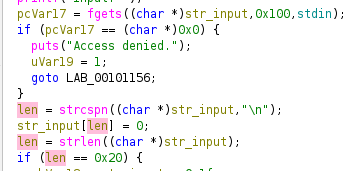
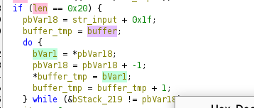
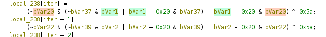
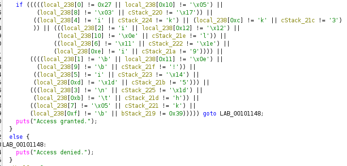

# Midnight Registry — Writeup

**Category:** Reverse Engineering  
**Flag:** `CCOI26{m1dn1ght_r3g1stry_k33p3r}`

---

## Overview

We're given a Linux binary (`midnight_registry.bin`) that asks for an "access token" and prints either "Access granted." or "Access denied." Our goal is to find the correct 32-character token, which is the flag.

---

## Step 1 — Initial Recon

```bash
file midnight_registry.bin

midnight_registry.bin: ELF 64-bit LSB pie executable, x86-64, dynamically linked, stripped
```

```bash
./midnight_registry.bin
====================================
         Midnight Registry
====================================
Validate your access token.

Input: test
Access denied.
```

A quick `strings` check confirms it's a simple flag checker — no anti-debug, no packing:

```bash
strings midnight_registry.bin | grep -i "access\|input\|flag"
Validate your access token.
Input: 
Access denied.
Access granted.
```

---

## Step 2 — Decompile with Ghidra

Open the binary in **Ghidra**, the main logic is at `FUN_001010a0`. Here's the cleaned-up version of what Ghidra shows:

### 1. Read input and check length



```c
fgets(input, 256, stdin);       // read user input
strcspn(input, "\n");           // strip newline
if (strlen(input) != 32)        // must be exactly 32 characters
    puts("Access denied.");
```

### 2. Reverse the string

```c
for (int i = 0; i < 32; i++)
    reversed[i] = input[31 - i];
```

### 3. Transform each byte (case-swap + XOR)

Ghidra shows SSE/SIMD operations, but they simplify to this per-byte logic:

```c
for (int i = 0; i < 32; i++) {
    byte b = reversed[i];
    if (b >= 'a' && b <= 'z')       // lowercase
        result[i] = (b - 0x20) ^ 0x5A;   // convert to uppercase, then XOR
    else if (b >= 'A' && b <= 'Z')  // uppercase
        result[i] = (b + 0x20) ^ 0x5A;   // convert to lowercase, then XOR
    else                            // digits, symbols
        result[i] = b ^ 0x5A;            // just XOR
}
```

### 4. Compare against hardcoded bytes



The transformed result is compared to 32 hardcoded bytes stored in `.rodata`. If they match → "Access granted."

You can find these bytes at addresses `0x2090–0x20AF` in the binary:

```
27 08 69 0a 69 69 11 05 03 08 0e 09 6b 1d 69 08
05 0e 12 1d 6b 14 1e 6b 17 21 6c 68 33 35 39 39
```

---

## Step 3 — Reverse the Transformation

The transform is fully reversible. For each expected byte `e`, we solve for the original character `b`:

- If the original was **lowercase**: `(b - 0x20) ^ 0x5A = e` → `b = (e ^ 0x5A) + 0x20`
- If the original was **uppercase**: `(b + 0x20) ^ 0x5A = e` → `b = (e ^ 0x5A) - 0x20`
- If the original was **other**: `b ^ 0x5A = e` → `b = e ^ 0x5A`

We try all three and pick whichever produces a valid character in the right range.

```python
expected = [
    0x27, 0x08, 0x69, 0x0a, 0x69, 0x69, 0x11, 0x05,
    0x03, 0x08, 0x0e, 0x09, 0x6b, 0x1d, 0x69, 0x08,
    0x05, 0x0e, 0x12, 0x1d, 0x6b, 0x14, 0x1e, 0x6b,
    0x17, 0x21, 0x6c, 0x68, 0x33, 0x35, 0x39, 0x39
]

reversed_input = []
for e in expected:
    b_lower = ((e ^ 0x5A) + 0x20) & 0xFF
    b_upper = ((e ^ 0x5A) - 0x20) & 0xFF
    b_other = e ^ 0x5A

    if 0x61 <= b_lower <= 0x7A:
        reversed_input.append(b_lower)
    elif 0x41 <= b_upper <= 0x5A:
        reversed_input.append(b_upper)
    else:
        reversed_input.append(b_other)

flag = ''.join(chr(b) for b in reversed_input[::-1])
print(flag)
```

```
CCOI26{m1dn1ght_r3g1stry_k33p3r}
```

---

## Step 4 — Verify

```bash
echo "CCOI26{m1dn1ght_r3g1stry_k33p3r}" | ./midnight_registry.bin
```
```
====================================
         Midnight Registry
====================================
Validate your access token.

Input: Access granted.
```

---

## Flag

```
CCOI26{m1dn1ght_r3g1stry_k33p3r}
```
